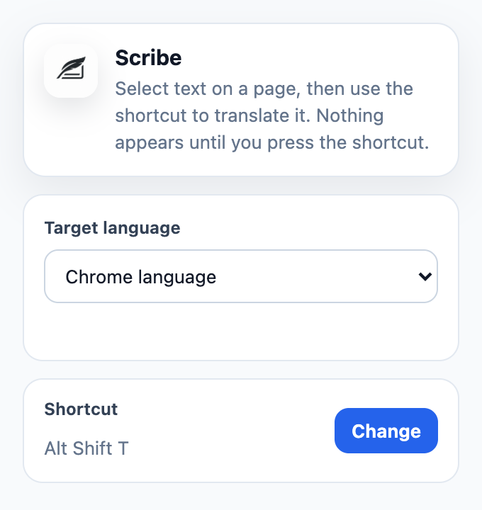

# Scribe

Chrome extension that translates selected page text into a temporary overlay without rewriting the page.



## Why

Reading foreign-language pages often breaks flow: copy text, switch tabs, paste it into a translator, then come back. Scribe keeps the interaction on the page by translating only the selected text when the user asks for it.

## What It Does

- Adds a keyboard shortcut for translating the current selection.
- Displays the translation near the selected text in a temporary overlay.
- Leaves the original page DOM unchanged.
- Lets the user choose a target language from the extension popup.
- Stores settings with `chrome.storage.sync`.
- Uses Chrome's local Translator and Language Detector APIs when available.

## Use It

1. Clone the repository:

```bash
git clone https://github.com/NicolasMasselot/Scribe.git
```

2. Open `chrome://extensions`.
3. Enable Developer mode.
4. Click Load unpacked.
5. Select the cloned `Scribe` folder.
6. Open the Scribe popup and choose a target language.
7. Select text on an `http` or `https` page and press `Alt+Shift+T`.

The shortcut can be changed from the popup or from `chrome://extensions/shortcuts`.

## Stack

- Chrome Manifest V3
- JavaScript, HTML, and CSS
- Chrome extension APIs: `activeTab`, `scripting`, `storage`, `commands`
- Chrome local Translator and Language Detector APIs

## Privacy Model

Scribe has no remote translation backend in this version. When Chrome's local translation APIs are available, selected text stays on device. If local translation is unavailable, the extension shows an unavailable state instead of sending text elsewhere.

## Project Structure

- `manifest.json` defines the MV3 extension, popup, options page, icons, permissions, and keyboard command.
- `background.js` listens for the keyboard shortcut and injects the translation flow into the active tab.
- `content.js` reads the selection, validates it, manages overlay lifecycle, and renders the result.
- `translator.js` wraps the local Chrome translation provider and fallback behavior.
- `popup.html`, `popup.css`, and `popup.js` provide language selection and shortcut access.
- `options.html` and `options.js` provide a simple fallback options page.

## Current Limits

- Requires Chrome 138+ for local translation support.
- Regular document selections only; textareas, inputs, iframes, shadow DOM, PDFs, Chrome Web Store pages, and `chrome://` pages are out of scope.
- Multi-line selection positioning is approximate.
